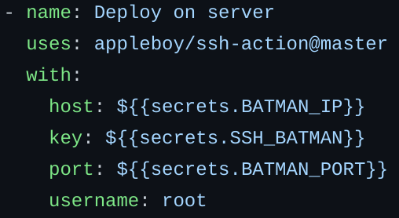

## Using Github actions

### Continuous Integrations (CI)
* DevOps software development practice to automate the integration of code changs from multiple contributors into a single software project.
* In simple terms, CI helps to build your code as soon as it is pushed into the branch where CI workflow is defined.
* This way we don't have to manually build and check for errors in the code. It would all be automated and done by github actions.
* Steps
    * Go to github actions tab on the site.
    * Click create new workflow.
    * Under the continuous integration workflows, click more  continuous integration workflows.
    * Select the **Python application** and click set up this workflow.
        * name: Self-explanatory
        * on: when do you want to trigger the scripts
        * push: Implies that the scripts will trigger on push
        * branches: On which branch shall the "event" (push, pull etc) occur, so as to trigger CI workflow.
        * jobs: **Most important part.**
        * build: We specify whether we are building or deploying (write deploy instead of build to let it know that its a deploy script)
        * runs-on: Remote desktop offered by **github.**
        * steps: Self-explanatory
        * uses: preferable keep it actions/checkout@v2. It implies that we are just building and not deploying. For deploying we will need to "ssh" into the server and hence we will need to change this.
        * name: name of the script
        * uses: Since, we selected python, keep it as it is.
        * with: Specify the version, for us it would be a python version.
        * run: Here write the script for building your project
        ```bash
        pip install flake8
        pip install pytest
        cd frontend
        npm install
        npm run build
        ```
        * The above script builds our react frontend project.
        * flake8 is a python library to check coding styles and warnings including some imported libraries that are unused and undefined names etc.
        * For information on pytest follow this [link](https://realpython.com/pytest-python-testing/)
        * Initially pytest will give an error and hence it would be better to comment it. This bug is yet to be fixed.
        * Commit the file and your CI is ready to go!

> Check for errors in the details section and resolve any that is encountered.

### Continuous Deployment (CD)
* It is a software release process that uses automated testing to validate any changes and deploys it to the server.
* Simply put, after CI, it deploys your code to the production environment automatically.


> There are two ways to acheive this. One, to accomodate the code in the CI.yml file itself and the other is to create a whole new file for increasing modularity.
* We have done the second approach.
* For the first one, copy the build code written above and instead of build (under jobs), write deploy and then write the code as per the below steps.

* Steps
    * Go to actions tab on the site.
    * Click create new workflow.
    * Click on **create a workflow yourself.**
    * Most of the code remains the same as that in CI.
    * Under jobs, replace build with deploy.
    * Delete the **workflow_dispatch** code.
    * Further, delete the **uses section and single command code** under **steps**.
    * By now, you will only be left with one multi-line script under **steps**.
    * Replace the **name** with anything relavant.
    * Then type the following without any tabs or indentation. **Note that the following should be exactly below name and without a hypen (-)**
        * uses: appleboy/ssh-action@master
        * This allows github to "ssh" into our server.
    * Now open a terminal in your **local machine** and type the following command.
        * ```bash
            ssh-keygen -C <EMAILID>
        ```
        * Make sure to replace <EMAILID> with radio's email ID.
        * This will create a new public and private key.
    * Then, go to the settings of the repository.
    * Left hand side, click on secrets and then click on new repository secret.
    * Provide your newly created **private key** and name it anything relevant.
    * Now "ssh" into the server and under .ssh/authorized_keys, place the newly created **public key** in it.
    * Now go back on github site and add the with section shown in the below image. Make sure it is exactly the same except changing the secrets name accoring to what you have added in github secrets.
    * 
    * **Make sure that you change the secrets with your respective server.**
    * With the same indentation as that of host, key etc. write script for deployment.
    * script: |
        ```bash
        cd stepwellradio
        git pull https://<YOUR_USERNAME>:<PERSONAL ACCESS TOKEN>@github.com/<USERNAME><REPO_NAME>.git
        python -m pip install --upgrade pip
        pip install flake8 pytest
        if [ -f requirements.txt ]; then pip install -r requirements.txt; fi
        cd frontend
        npm install
        cd ..
        cd backend
        python manage.py collectstatic
        echo "Deployed Successfully"
        ```
    * Once it is done, you are good to go.
    * Check details of guthub actions to make sure that there aren't any errors during the deployment.
    * Some potential errors
        * python, pip, nodejs and npm not installed.
        * So make sure that these are installed on the server.
        * **Note that these errors are just for first time set up of the server and hence the commands that are needed to install these need not be placed under the scripts.**

> There are certain errors that are yet to be resolved like deploy should happen after build returns exit code 0 and some python virtual environment related issues.